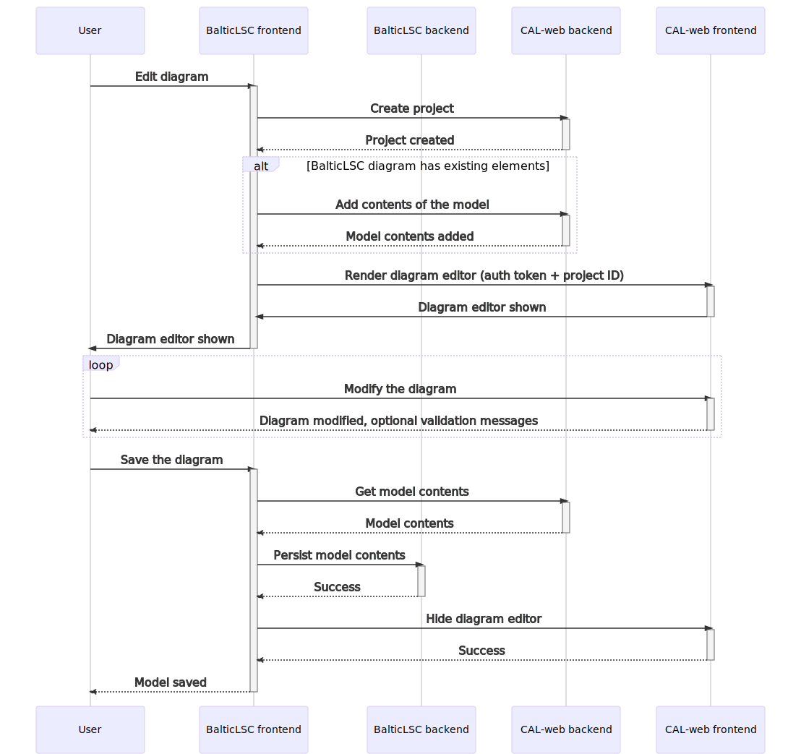
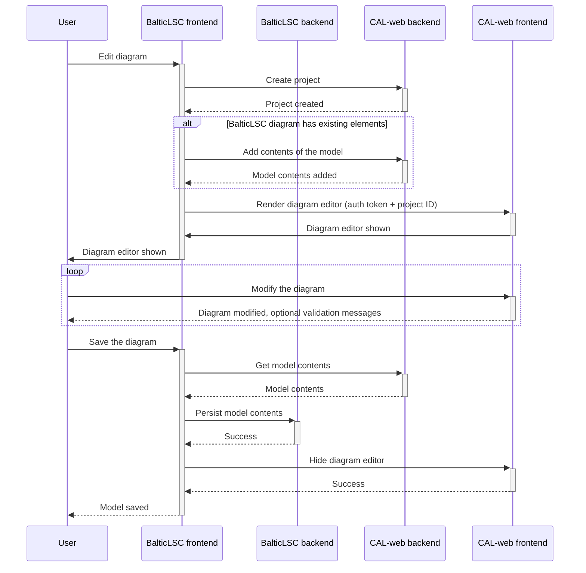

# Integrating CAL-web with BalticLSC

This document describes how to integrate CAL-web with BalticLSC.

<!-- vim-markdown-toc GFM -->

- [High-level idea](#high-level-idea)
  - [Creating a CAL-web project for a diagram](#creating-a-cal-web-project-for-a-diagram)
  - [Rendering the CAL-web diagram editor](#rendering-the-cal-web-diagram-editor)
  - [Saving the model changes](#saving-the-model-changes)
- [Possible enhancements](#possible-enhancements)
  - [Preventing accidental data loss](#preventing-accidental-data-loss)
  - [Periodic cleanup of stale CAL-web projects](#periodic-cleanup-of-stale-cal-web-projects)

<!-- vim-markdown-toc -->

## High-level idea

The main idea is that the BalticLSC frontend will be responsible for creating a
Sirius Web project and then rendering CAL-web to edit the diagram. Once the user
is done editing, BalticLSC frontend will fetch the model and upload it back to
the BalticLSC backend.

Diagram source code

Using [Mermaid](https://mermaid-js.github.io/mermaid/#/sequenceDiagram).

SVG copied and optimized using
[SVGOMG](https://jakearchibald.github.io/svgomg/).

### Creating a CAL-web project for a diagram

Each BalticLSC diagram will be representated as a model inside of a separate
CAL-web project. This way the CAL-web workbench will only display objects from
that single model.

Since each user has access to only the projects they own, users will not be able
to see or modify each others models, and thus diagrams.

Projects are ephemeral. Each time the user wants to edit a diagram, a new
project will be created. This way there is no need to keep the previously
created models in sync between BalticLSC and CAL-web. BalticLSC will serve as
the source of truth for model/diagram contents.

Before CAL-web is shown, the BalticLSC frontend will need to create a CAL-web
project for that user (using the REST API provided by CAL-web backend) and then
hydrate it with existing contents of the model. This means converting all
objects inside the BalticLSC model into a CAL-web model.

At the moment, there is no CAL-web endpoint which allows creating multiple
objects in one go. It would be suitable to add a new REST endpoint or a GraphQL
mutation in CAL-web backend that would hydrate multiple objects in one go. After
all, it is easier to manipulate the model from inside the backend and this would
also mean fewer API calls to create the objects.

There is also no BalticLSC API that would respond with the contents of the whole
model using domain objects. This feature would need to be added to the BalticLSC
backend.

### Rendering the CAL-web diagram editor

After the CAL-web project is created and populated with the model contents, the
CAL-web diagram editor can be shown in the UI.

A prerequisite to showing the workbench is finding out some Sirius Web-specific
properties of that model - the representation and the editing context ID. To do
that, the `resolveWorkbenchProperties` function from the UI library API should
be used.

After that information is available to the BalticLSC frontend, it can invoke the
`renderApp` CAL-web UI library function to show the workbench application.

An example frontend application using the CAL-web UI library is available
[in the repository](../frontend-library-example/README.md).

### Saving the model changes

After the user is done editing the diagram, the changes done in CAL-web should
be persisted in BalticLSC. This is a 2-step process orchestrated by the
BalticLSC frontend:

1. Fetch the model contents from the CAL-web backend.

   There is at the moment no convenient REST API or GraphQL query to fetch model
   contents.

   One could use the `treeEvent` GraphQL subscription to iteratively fetch the
   model contents, like
   [it is done in the CAL-web frontend already](https://github.com/Gelio/CAL-web/blob/1920ce5951b89d9e85f7c30ebfe2e463e237c01c/frontend/src/views/edit-project/Workbench/Toolbox/root-object-id.ts#L143-L166).

   Alternatively, a new GraphQL query can be used that returns the model
   contents.

2. Store the model contents back in BalticLSC backend

   This step requires adding a new API endpoint to BalticLSC to persist the
   contents.

   Keep in mind this will not be a _diff_ of the changes, but the whole model.
   It will be up to the BalticLSC backend to decide whether the find the
   difference between the current model and the updated model and only update
   necessary parts, or replace the model entirely, throwing away all the
   previous objects and recreting them.

At this point, the CAL-web UI can be hidden using the `unmountApp` UI library
API.

## Possible enhancements

There are possible enhancements to the basic flow described above.

### Preventing accidental data loss

Each time the user wants to edit a new diagram, a new project is created based
on whatever model data is in BalticLSC. This means that if the user accidentally
closes the browser while editing a CAL-web model, they would not be able to
recover it, because clicking _Edit_ would create a new model.

To alleviate this problem, the BalticLSC frontend could store a list of recently
edited projects which were not saved and allow the user to return to such a
project.

This would help with accidental data loss and improve the user experience.

### Periodic cleanup of stale CAL-web projects

Since CAL-web projects are ephemeral and not needed after the user is done
updating them, they can be removed periodically to avoid storing unnecessary
data in the database.

For example, once every day, projects containing models which were not updated
in the last week could be removed. This would make it so that the database will
contain models which were actively modified in the last week.

<!-- vim: set tw=80: -->
